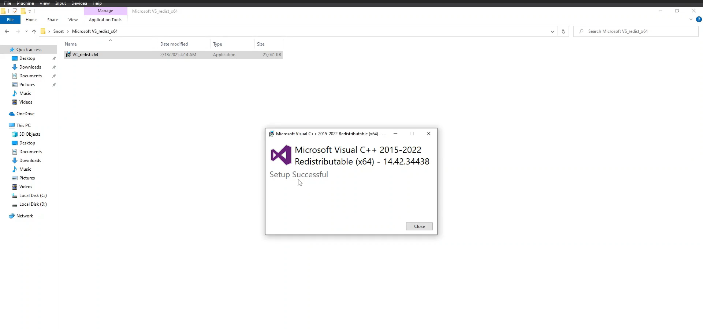

# Snort - IDS/IPS (Intrusion Detection/Prevention System)

## 1. Introduction

Intrusion Detection Systems (IDS) are essential for monitoring and detecting potential security breaches in a network. Snort is a powerful, open-source network IDS that can perform real-time traffic analysis and packet logging.

## 2. Objectives

- To install and configure Snort IDS.
- To monitor network traffic and detect potential intrusions.
- To analyze and interpret Snort alerts.

## 3. Prerequisites

- Basic knowledge of networking concepts.
- Understanding of network protocols (TCP/IP, HTTP, DNS, etc.).
- Familiarity with Windows command line.

## 4. Tools and Software

- **Snort**: Open-source network intrusion detection system.
- **Virtual Machine**: For creating a safe environment to run Snort.

## 5. Setting Up the Environment

**Lab Setup**

1. Download Snort IDS from the [official website](https://www.snort.org/downloads)

 

2. Install Microsoft Visual C++ 2015-2022 Redistributable (x64).

 

3. Download and install the Npcap.

    

4. Install Snort.

     

## 6. Configuring Snort

**Step 1: 💻 Set the network variables**

ipvar HOME_NET IP_ADDRESS

ipvar EXTERNAL_NET !$HOME_NET

 

**Step 2: 💻 Specify the Path to the rules files**

var RULE_PATH c:\Snort\rules

var PREPROC_RULE_PATH c:\Snort\preproc_rules

var WHITE_LIST_PATH c:\Snort\rules

var BLACK_LIST_PATH c:\Snort\rules

**Step 3: 💻 Configure default log directory for snort**

config logdir: c:\Snort\log

**Step 4: 💻 Configure dynamic loaded libraries**

dynamicpreprocessor directory c:\Snort\lib\snort_dynamicpreprocessor

dynamicengine c:\Snort\lib\snort_dynamicengine\sf_engine.dll

**Step 5: 💻 Configure the Reputation preprocessor**

whitelist $WHITE_LIST_PATH\whitelist.rules

blacklist $BLACK_LIST_PATH\blacklist.rules

**Step 6: 💻 Customize the rule set as follows**

Example:

   

## 7. Validating the Snort Configuration

1. Open -> Command Prompt -> Run as administrator

2. Navigate to the Snort Installation directory.

cd \Snort\bin

3. Run the following command:

snort.exe -i 4 -c C:\Snort\etc\snort.conf -T

 

## 8. Writing Snort Rules

1. Navigate to the Snort Installation directory - > Select rules folder - > Edit the (local.rules) files in Notepad++.

LOCAL RULES

alert icmp any any -> $HOME_NET any (msg:"ICMP Ping Detected"; sid:1000001; rev:1;)

alert tcp any any -> $HOME_NET 22 (msg:"SSH Authentication Attempt"; sid:1000002; rev:1;)

alert tcp any any -> IP_Address Port (msg:"FTP Connection Attempt"; sid:1000003; rev:1;)

## 9. Running Snort in IDS Mode

1. **Start Snort**: Run Snort in IDS mode to monitor network traffic.

2. Run the following command:

snort.exe -i 4 -c C:\Snort\etc\snort.conf -A console

     

## 10. Analyzing Alerts

1. **View Alerts**: Snort will display alerts in the console if any suspicious activity is detected.
2. **Analyze Logs**: Review the log files generated by Snort for detailed information on the detected intrusions.

Command:

snort.exe -i 4 -c C:\Snort\etc\snort.conf -A console > C:\Snort\log\test_logs_001.txt

  

## 11. Conclusion

By completing this project, I have gained practical hands-on experience in setting up and using Snort IDS to detect network intrusions. Understanding how to configure and analyze Snort alerts is essential for identifying and mitigating potential security threats.
